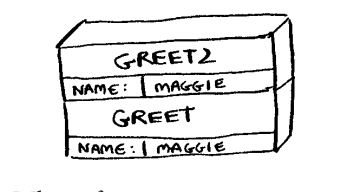

# Exercise 3

### 3.1 Suppose I show you a call stack like this. What information can you give me, just based on this call stack?

The Stack uses the LIFO principle, so the GREET2 function which entered last will be executed first and return control to the GREET function 

### 3.2 Suppose you accidentally write a recursive function that runs forever. As you saw, your computer allocates memory on the stack for each function call. What happens to the stack when your recursive function runs forever?

The stack will get filled up with lots of function calls' variable and reach it's stack limit leading to a **Stack Overflow**
