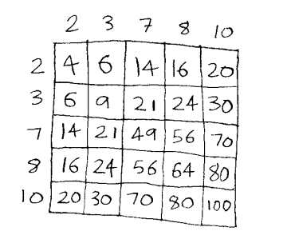

# Exercise 4

### 4.1 Write out the code for the earlier sum function.

```py
def sum(arr):
    """
    A function to find the sum of an array
    :param arr - an array to sum
    :return int
    """

    total=0

    for item in arr:
        total+=item

    return total

```

### 4.2 Write a recursive function to count the number of items in a list.

```py
def recursive_count(arr):
    """
    A function to count the nummber of items in an aarray using recursion
    :param arr - an array to count
    :return int - th ecounts of the array
    """

    if not arr:
        return 0

    return 1+recursive_count(arr[1:])
```

### 4.3 Write a recursive function to find the maximum number in a list.

```py
def recursive_max(arr):
    """
    A recursive function to find the maximum number in a list
    :param arr: the lists of elements
    :Return int
    """

    if len(arr)==1:
        return arr[0]

    sub_max=recursive_max(arr[1:])

    if arr[0]>sub_max:
        return arr[0]
    else:
        return sub_max
```

### 4.4 Remember binary search from chapter 1? It’s a D&C algorithm, too. Can you come up with the base case and recursive case for binary search?

THe base cases are:

- returning None if the taraget is not found
- returning the index of teh guess if found

The recursive case:

## How long would each of these operations take in big O notation?

### 4.5 Printing the value of each element in an array.

O (n)

### 4.6 Doubling the value of each element in an array.

O (n) - Doubline the value is O(1), but since we are doing it for each of the element, we do it at n\*1 making it O(n)

### 4.7 Doubling the value of just the first element in an array.

O(1) - regardliess of the number of items in the array, we just double the first without any looping using arr[0]

### 4.8 Creating multiplication table with all the elements in the array. So if your array is [2, 3, 7, 8, 10], you first multiply every element by 2, then multiply every element by 3, then by 7, and so on.



O(n\*n)
