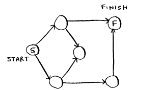
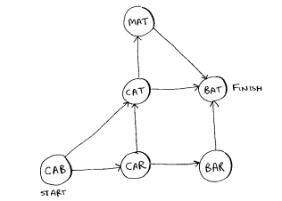

# Exercise 6

## Run the breadth-first search algorithm on each of these graphs to find the solution.

### 6.1 Find the length of the shortest path from start to finish.

2

### 6.2 Find the length of the shortest path from “cab” to “bat.”

2
